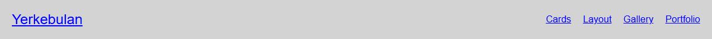
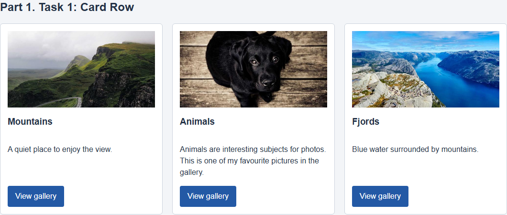
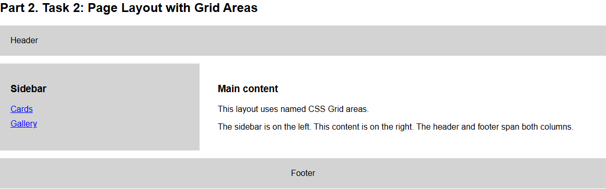
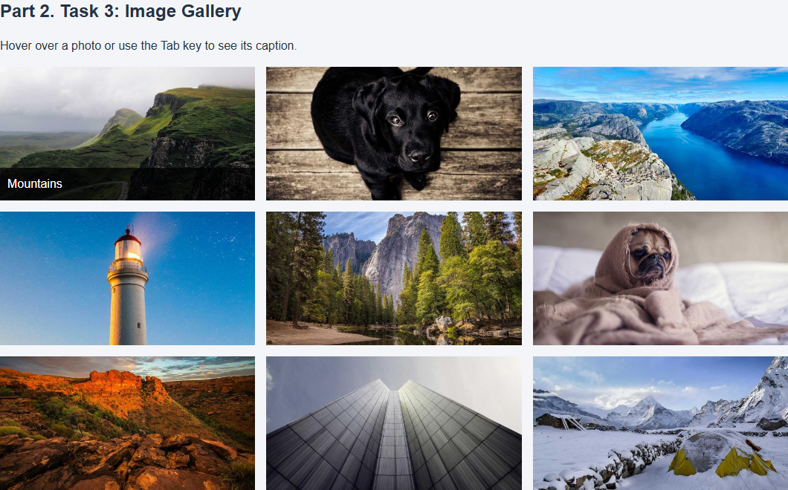
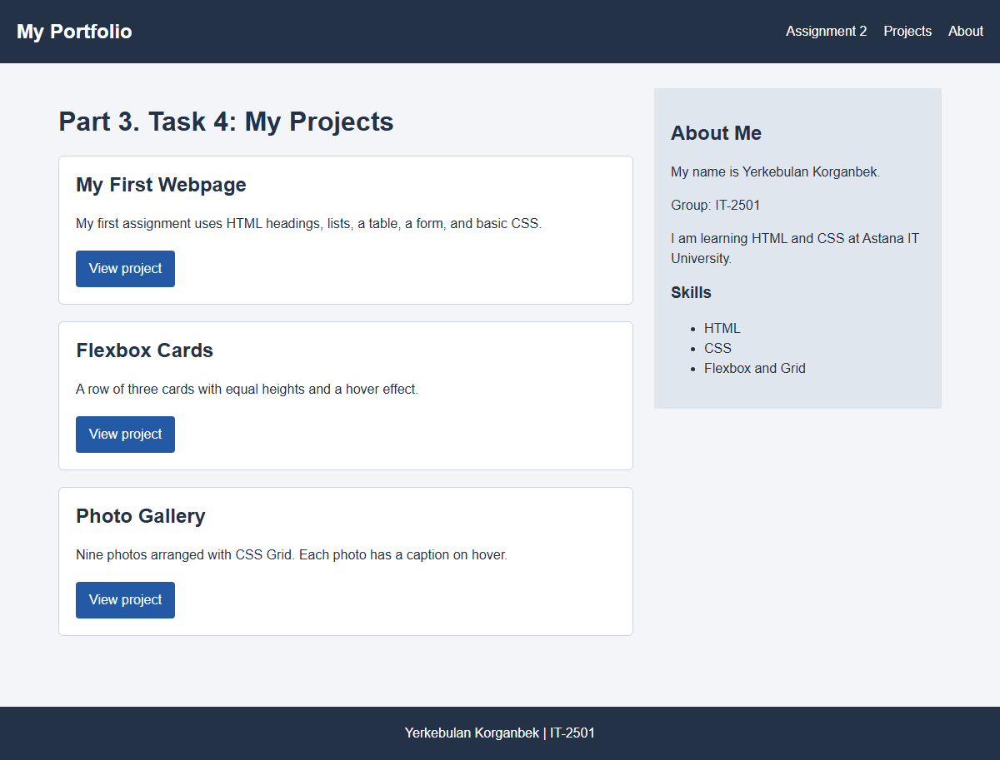

# Assignment 2: Flexbox and Grid

**Name:** Yerkebulan Korganbek

**Group:** IT-2501

## Project URL

Repository: https://github.com/Erkosh-IT/Erkosh-IT.github.io
Live page: https://erkosh-it.github.io/

## How to open the project

Open assignment2/index.html in a browser. The navigation link opens assignment2/portfolio.html. Everything is made with plain HTML and CSS, so no installation is needed.

## Part 1: Flexbox

### Task 0: Navigation bar

I made the header a Flexbox container. The logo stays on the left and the navigation links stay on the right. The align-items property keeps them vertically aligned, while the gap property adds space between the links.

### Task 1: Card row

The page has three cards. Each card contains an image, a title, a short description, and a button. Flexbox places the cards in a row, gives them equal space, and keeps their heights consistent. The cards have a simple light-gray hover effect.

## Part 2: Grid system

### Task 2: Page layout with grid areas

I used CSS Grid to make a small page layout with a header, sidebar, main content, and footer. The header and footer stretch across the page. The sidebar is on the left and the main content is on the right. Named grid areas make each position easy to understand.

### Task 3: Image gallery

The gallery contains nine local images. Grid makes three equal columns and three equal rows, with a small gap between the images. When the mouse moves over an image, a short caption appears at the bottom.

## Part 3: Combining Flexbox and Grid

### Task 4: Portfolio page

The portfolio page uses Flexbox in its header. Grid divides the main area into a projects section and an information sidebar. Each project card uses Flexbox to arrange its title, description, and button from top to bottom.

## Short work summary

I first created the HTML pages and then added the CSS layout. I used Flexbox for the navigation and cards, and Grid for the page layout and gallery. After that, I combined both methods on the portfolio page. I checked the links, hover effects, image layout, and page appearance in a browser.

## Image sources

The nine photos came from [Lorem Picsum](https://picsum.photos/) and are saved locally in assignment2/images, so the gallery also works without an internet connection.

## Previous assignment

[Assignment 1 report](assignment1/README.md)
