# Assignment 3: Responsive Web Design

**Name:** Yerkebulan Korganbek

**Group:** IT-2501

## Project URL

[GitHub repository](https://github.com/Erkosh-IT/Erkosh-IT.github.io)

[Assignment 3 website](https://erkosh-it.github.io/assignment3/)

## How to open the project

Open assignment3/index.html, or use the website link above. You can open the other two pages from the navigation menu. The downloaded project works offline too.

## Part 1: Media Queries

### Task 0: Responsive Typography

For the first task, I added a heading and a few paragraphs. The text gets bigger at 768px and again at 992px. The main heading changes from 24px to 30px and then 36px. The paragraph sizes are 16px, 18px, and 20px.

Mobile, 390px:

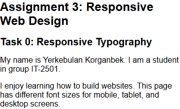

Tablet, 820px:

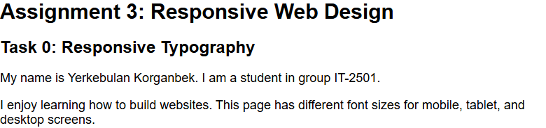

Desktop, 1200px:

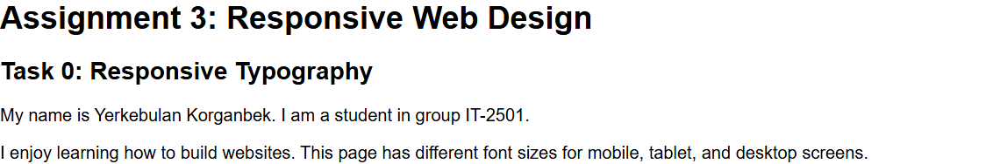

### Task 1: Responsive Layout with Media Queries

The three boxes are on the same page as Task 0. On a phone they go one below another. On a tablet, two fit next to each other and the third goes below. All three fit in one row on desktop. I used media queries to change the number of Grid columns.

Mobile, 390px:

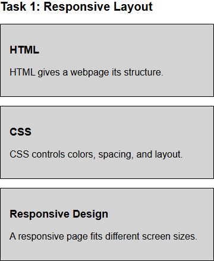

Tablet, 820px:

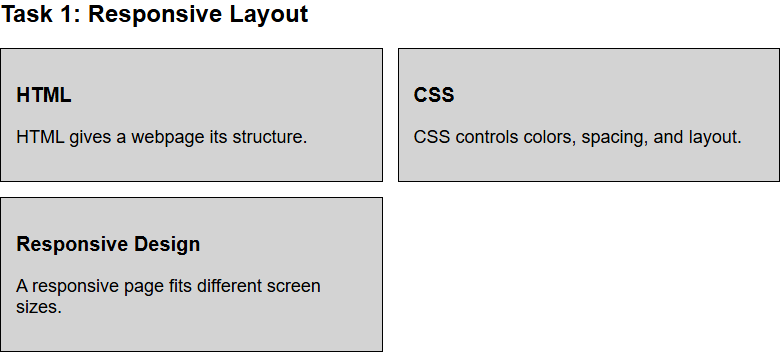

Desktop, 1200px:

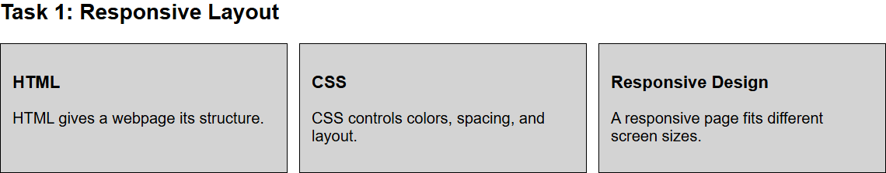

## Part 2: Bootstrap Grid System

### Task 2: Bootstrap Responsive Columns

This task has the same layout as Task 1, but uses Bootstrap classes. I used col-12, col-md-6, and col-lg-4 on each box. They take the full row on mobile, half a row on tablet, and a third of a row on desktop.

Mobile, 390px:

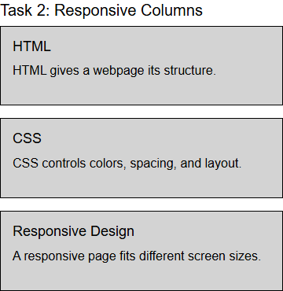

Tablet, 820px:

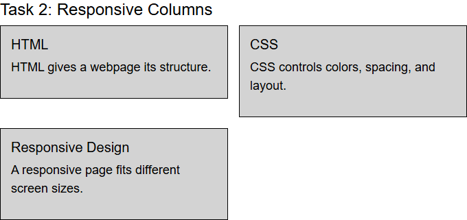

Desktop, 1200px:

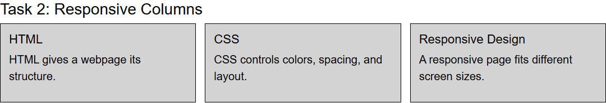

### Task 3: Bootstrap Navigation Bar

I put my name on the left of the navbar and the page links on the right. On screens smaller than 992px, there is a menu button instead of the row of links. Bootstrap's JavaScript makes the button open and close the menu.

Mobile with the menu open:

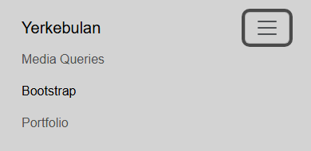

Tablet with the menu open:

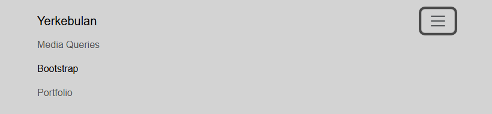

Desktop:

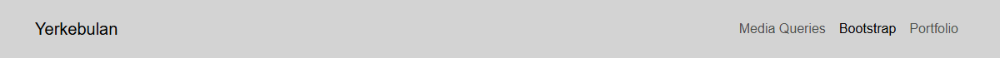

## Part 3: Combined Project

### Task 4: Responsive Portfolio Page

For the portfolio, I added cards linking to my three assignments. The About Me section contains my name, group, and GitHub link. It sits beside the projects on larger screens and below them on mobile. There is also a navbar at the top and a footer at the bottom.

Bootstrap handles the columns. My media queries change the text size and padding. They also hide the short introduction on mobile, where there is less space.

Mobile, 390px:

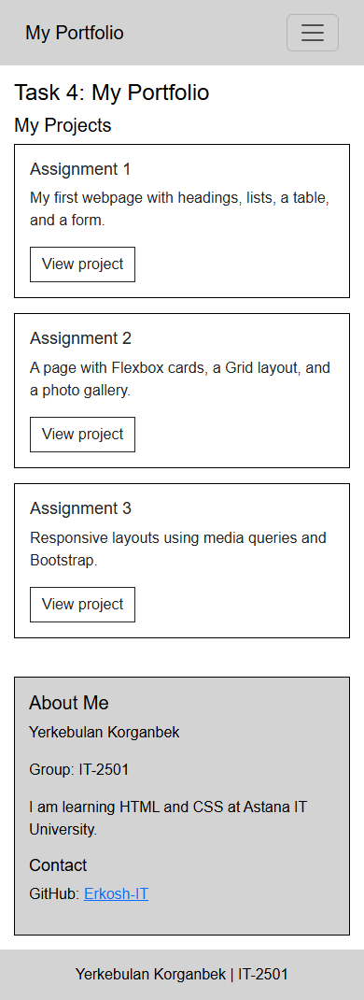

Tablet, 820px:

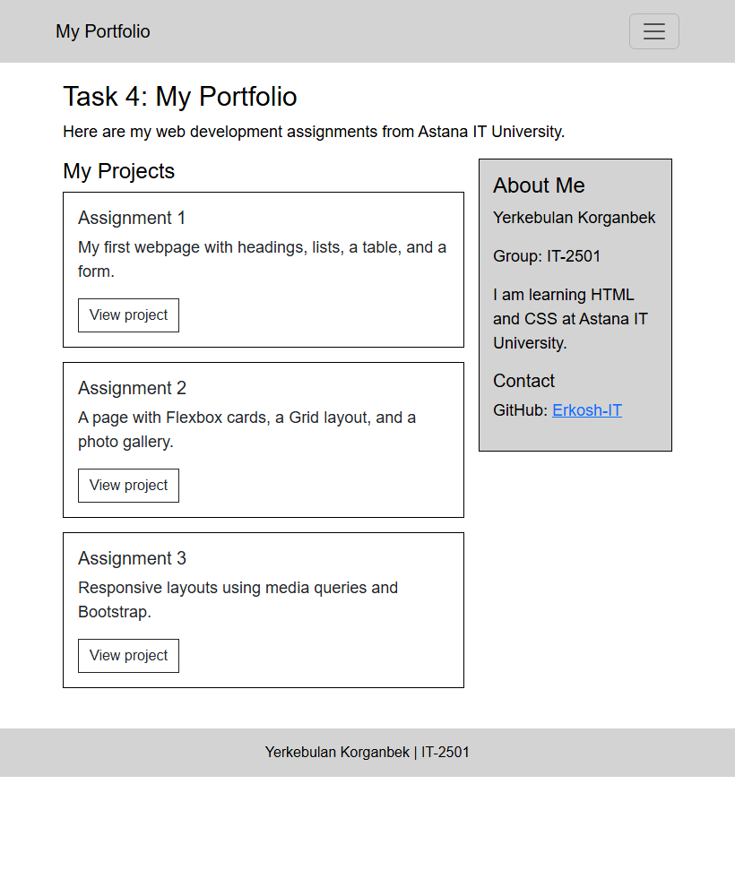

Desktop, 1200px:

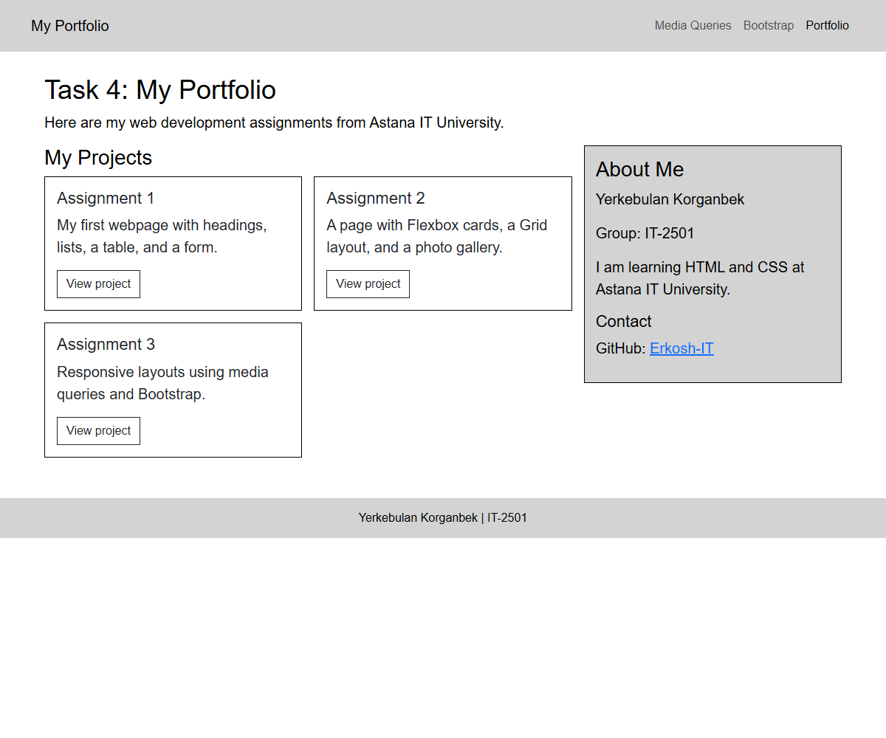

## Work Summary

I made the HTML pages first, then added the media queries and Bootstrap layouts. After putting the portfolio together, I checked the pages at different widths. I checked that the boxes moved to the right rows, the text changed size, and the menu button worked. The screenshots show the result at 390px, 820px, and 1200px.

## Resources

Bootstrap version: 5.3.3. Reference: [Bootstrap documentation](https://getbootstrap.com/docs/5.3/getting-started/introduction/).

## Previous Assignments

[Assignment 1 report](assignment1/README.md)

[Assignment 2 report](assignment2/README.md)
